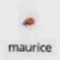

# PNG Steganography

This tool hides and obfuscates arbitrary data in PNG files. The file
is still valid after the modification and remains readable by image
viewers.

This is the image before encoding:



This is the image after encoding:


They look exactly the same because their image data is identical! The
second, though, has some additional non-image data embedded in
the file.

## Example usage

```console
$ file examples/maurice.png
examples/maurice.png: PNG image data, 100 x 100, 8-bit/color RGB, non-interlaced

$ echo "i love reading documentation" | python3 ./src/encode.py ./examples/maurice.png

$ python3 ./src/decode.py ./examples/maurice.png
i love reading documentation

$ # still a valid image!
$ file examples/maurice.png
examples/maurice.png: PNG image data, 100 x 100, 8-bit/color RGB, non-interlaced
```

## How?

PNG files consist of chunks of arbitrary data. Each chunk records the
length of the data and type of the chunk, followed by the actual data,
with a 4 byte checksum at the end.

The input data is encrypted with ChaCha and wrapped in a chunk whose
type indicates that it is ancillary (optional) and that image viewers
should ignore it. The key and nonce are included as well, so in
practice this is "encoding", as no secrets are required to decrypt the
data.

For more information, see [the
specification](http://www.libpng.org/pub/png/spec/1.2/PNG-Structure.html)
